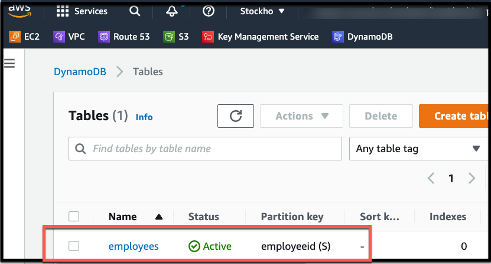
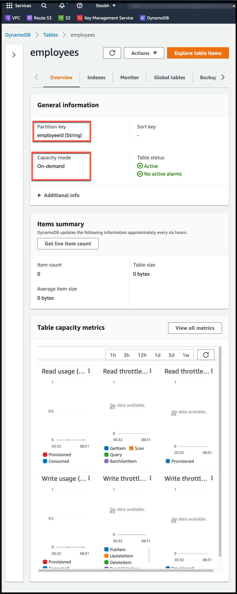

# AWS dynamoDB
- create dynamoDB table
    - table name is employees
    - one row named employeeid of type string

# How to use
If you didn't clone the repo yet, do that by accessing this [link](https://github.com/ion-onboarding/book-terraform-up) then return back here.\
Open a shell and drive to:
```
cd ch3/dynamodb
```

# Create resources
```
terraform init
```
```
terraform apply -auto-approve
```

# Destroy resources
```
terraform destroy -auto-approve
```

# Sample output when resources already created
## One resource created
```
$ terraform state list
aws_dynamodb_table.table_employees
```

## Screentshots AWS console



# Sample output
## Create resources
```
terraform init

Initializing the backend...

Initializing provider plugins...
- Finding latest version of hashicorp/aws...
- Installing hashicorp/aws v4.6.0...
- Installed hashicorp/aws v4.6.0 (signed by HashiCorp)

Terraform has created a lock file .terraform.lock.hcl to record the provider
selections it made above. Include this file in your version control repository
so that Terraform can guarantee to make the same selections by default when
you run "terraform init" in the future.

Terraform has been successfully initialized!

You may now begin working with Terraform. Try running "terraform plan" to see
any changes that are required for your infrastructure. All Terraform commands
should now work.

If you ever set or change modules or backend configuration for Terraform,
rerun this command to reinitialize your working directory. If you forget, other
commands will detect it and remind you to do so if necessary.
```

```
$ terraform apply -auto-approve

Terraform used the selected providers to generate the following execution plan. Resource actions are indicated with the
following symbols:
  + create

Terraform will perform the following actions:

  # aws_dynamodb_table.table_employees will be created
  + resource "aws_dynamodb_table" "table_employees" {
      + arn              = (known after apply)
      + billing_mode     = "PAY_PER_REQUEST"
      + hash_key         = "employeeid"
      + id               = (known after apply)
      + name             = "employees"
      + read_capacity    = (known after apply)
      + stream_arn       = (known after apply)
      + stream_label     = (known after apply)
      + stream_view_type = (known after apply)
      + tags             = {
          + "environment" = "test-dev"
        }
      + tags_all         = {
          + "environment" = "test-dev"
        }
      + write_capacity   = (known after apply)

      + attribute {
          + name = "employeeid"
          + type = "S"
        }

      + point_in_time_recovery {
          + enabled = (known after apply)
        }

      + server_side_encryption {
          + enabled     = (known after apply)
          + kms_key_arn = (known after apply)
        }

      + ttl {
          + attribute_name = (known after apply)
          + enabled        = (known after apply)
        }
    }

Plan: 1 to add, 0 to change, 0 to destroy.

Changes to Outputs:
  + dynamodb_arn = (known after apply)
aws_dynamodb_table.table_employees: Creating...
aws_dynamodb_table.table_employees: Creation complete after 7s [id=employees]

Apply complete! Resources: 1 added, 0 changed, 0 destroyed.

Outputs:

dynamodb_arn = "arn:aws:dynamodb:eu-north-1:267023797923:table/employees"
```

## Destroy resources
```
terraform destroy -auto-approve
aws_dynamodb_table.table_employees: Refreshing state... [id=employees]

Terraform used the selected providers to generate the following execution plan. Resource actions are indicated with the
following symbols:
  - destroy

Terraform will perform the following actions:

  # aws_dynamodb_table.table_employees will be destroyed
  - resource "aws_dynamodb_table" "table_employees" {
      - arn            = "arn:aws:dynamodb:eu-north-1:267023797923:table/employees" -> null
      - billing_mode   = "PAY_PER_REQUEST" -> null
      - hash_key       = "employeeid" -> null
      - id             = "employees" -> null
      - name           = "employees" -> null
      - read_capacity  = 0 -> null
      - stream_enabled = false -> null
      - tags           = {
          - "environment" = "test-dev"
        } -> null
      - tags_all       = {
          - "environment" = "test-dev"
        } -> null
      - write_capacity = 0 -> null

      - attribute {
          - name = "employeeid" -> null
          - type = "S" -> null
        }

      - point_in_time_recovery {
          - enabled = false -> null
        }

      - ttl {
          - enabled = false -> null
        }
    }

Plan: 0 to add, 0 to change, 1 to destroy.

Changes to Outputs:
  - dynamodb_arn = "arn:aws:dynamodb:eu-north-1:267023797923:table/employees" -> null
aws_dynamodb_table.table_employees: Destroying... [id=employees]
aws_dynamodb_table.table_employees: Destruction complete after 3s

Destroy complete! Resources: 1 destroyed.
```
