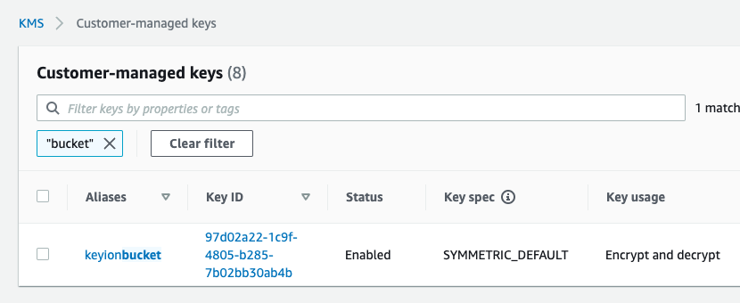
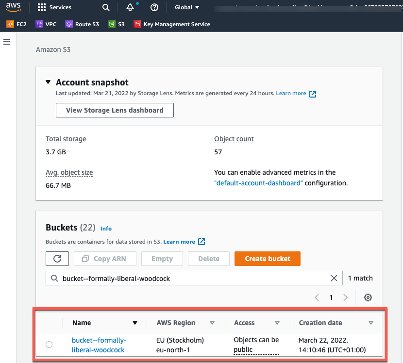
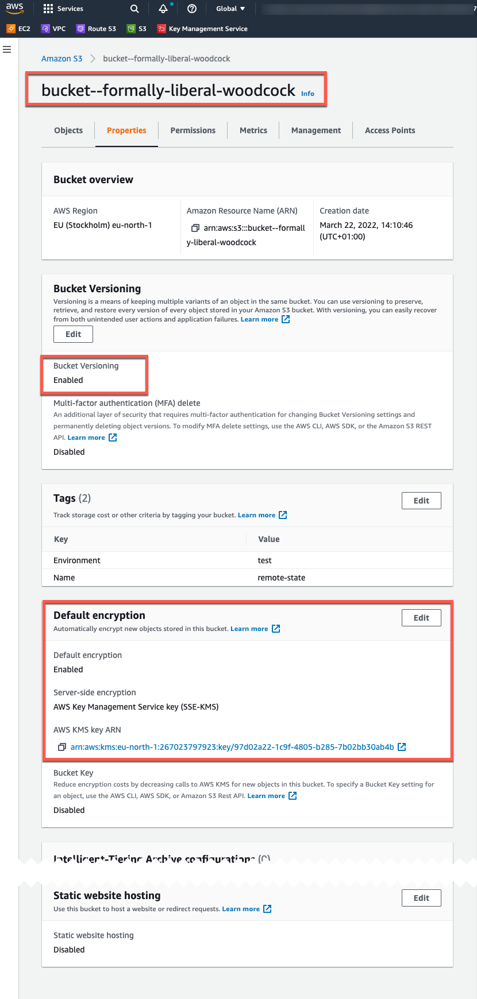

# AWS S3 bucket
- create an S3 bucket
    - create encryption key
    - enable versioning
    - enable server side encryption with created key

# How to use
If you didn't clone the repo yet, do that by accessing this [link](https://github.com/ion-onboarding/book-terraform-up) then return back here.\
Open a shell and drive to:
```
cd ch3/s3-bucket
```

# Create resources
```
terraform init
```
```
terraform apply -auto-approve
```

# Destroy resources
```
terraform destroy -auto-approve
```

# Sample output: when resources are created already
```
terraform state list
aws_kms_alias.alias-key-bucket
aws_kms_key.key-bucket
aws_s3_bucket.bucket
aws_s3_bucket_server_side_encryption_configuration.example
aws_s3_bucket_versioning.versioning-bucket
random_pet.random_string
```

# Sample output: screenshots AWS when resources are created already





# Sample output: creating resources
```
terraform init

Initializing the backend...

Initializing provider plugins...
- Finding latest version of hashicorp/random...
- Finding latest version of hashicorp/aws...
- Installing hashicorp/random v3.1.2...
- Installed hashicorp/random v3.1.2 (signed by HashiCorp)
- Installing hashicorp/aws v4.6.0...
- Installed hashicorp/aws v4.6.0 (signed by HashiCorp)

Terraform has created a lock file .terraform.lock.hcl to record the provider
selections it made above. Include this file in your version control repository
so that Terraform can guarantee to make the same selections by default when
you run "terraform init" in the future.

Terraform has been successfully initialized!

You may now begin working with Terraform. Try running "terraform plan" to see
any changes that are required for your infrastructure. All Terraform commands
should now work.

If you ever set or change modules or backend configuration for Terraform,
rerun this command to reinitialize your working directory. If you forget, other
commands will detect it and remind you to do so if necessary.
```

```
terraform apply -auto-approve

Terraform used the selected providers to generate the following execution plan. Resource actions are indicated with the following symbols:
  + create

Terraform will perform the following actions:

  # aws_kms_alias.alias-key-bucket will be created
  + resource "aws_kms_alias" "alias-key-bucket" {
      + arn            = (known after apply)
      + id             = (known after apply)
      + name           = "alias/keyionbucket"
      + name_prefix    = (known after apply)
      + target_key_arn = (known after apply)
      + target_key_id  = (known after apply)
    }

  # aws_kms_key.key-bucket will be created
  + resource "aws_kms_key" "key-bucket" {
      + arn                                = (known after apply)
      + bypass_policy_lockout_safety_check = false
      + customer_master_key_spec           = "SYMMETRIC_DEFAULT"
      + description                        = "This key is used to encrypt bucket objects"
      + enable_key_rotation                = false
      + id                                 = (known after apply)
      + is_enabled                         = true
      + key_id                             = (known after apply)
      + key_usage                          = "ENCRYPT_DECRYPT"
      + multi_region                       = (known after apply)
      + policy                             = (known after apply)
      + tags_all                           = (known after apply)
    }

  # aws_s3_bucket.bucket will be created
  + resource "aws_s3_bucket" "bucket" {
      + acceleration_status                  = (known after apply)
      + acl                                  = (known after apply)
      + arn                                  = (known after apply)
      + bucket                               = (known after apply)
      + bucket_domain_name                   = (known after apply)
      + bucket_regional_domain_name          = (known after apply)
      + cors_rule                            = (known after apply)
      + force_destroy                        = false
      + grant                                = (known after apply)
      + hosted_zone_id                       = (known after apply)
      + id                                   = (known after apply)
      + lifecycle_rule                       = (known after apply)
      + logging                              = (known after apply)
      + object_lock_enabled                  = (known after apply)
      + policy                               = (known after apply)
      + region                               = (known after apply)
      + replication_configuration            = (known after apply)
      + request_payer                        = (known after apply)
      + server_side_encryption_configuration = (known after apply)
      + tags                                 = {
          + "Environment" = "test"
          + "Name"        = "remote-state"
        }
      + tags_all                             = {
          + "Environment" = "test"
          + "Name"        = "remote-state"
        }
      + versioning                           = (known after apply)
      + website                              = (known after apply)
      + website_domain                       = (known after apply)
      + website_endpoint                     = (known after apply)

      + object_lock_configuration {
          + object_lock_enabled = (known after apply)
          + rule                = (known after apply)
        }
    }

  # aws_s3_bucket_server_side_encryption_configuration.example will be created
  + resource "aws_s3_bucket_server_side_encryption_configuration" "example" {
      + bucket = (known after apply)
      + id     = (known after apply)

      + rule {
          + apply_server_side_encryption_by_default {
              + kms_master_key_id = (known after apply)
              + sse_algorithm     = "aws:kms"
            }
        }
    }

  # aws_s3_bucket_versioning.versioning-bucket will be created
  + resource "aws_s3_bucket_versioning" "versioning-bucket" {
      + bucket = (known after apply)
      + id     = (known after apply)

      + versioning_configuration {
          + mfa_delete = (known after apply)
          + status     = "Enabled"
        }
    }

  # random_pet.random_string will be created
  + resource "random_pet" "random_string" {
      + id        = (known after apply)
      + length    = 3
      + prefix    = "-"
      + separator = "-"
    }

Plan: 6 to add, 0 to change, 0 to destroy.
random_pet.random_string: Creating...
random_pet.random_string: Creation complete after 0s [id=--formally-liberal-woodcock]
aws_kms_key.key-bucket: Creating...
aws_s3_bucket.bucket: Creating...
aws_kms_key.key-bucket: Creation complete after 1s [id=97d02a22-1c9f-4805-b285-7b02bb30ab4b]
aws_kms_alias.alias-key-bucket: Creating...
aws_kms_alias.alias-key-bucket: Creation complete after 0s [id=alias/keyionbucket]
aws_s3_bucket.bucket: Creation complete after 1s [id=bucket--formally-liberal-woodcock]
aws_s3_bucket_versioning.versioning-bucket: Creating...
aws_s3_bucket_server_side_encryption_configuration.example: Creating...
aws_s3_bucket_server_side_encryption_configuration.example: Creation complete after 1s [id=bucket--formally-liberal-woodcock]
aws_s3_bucket_versioning.versioning-bucket: Creation complete after 2s [id=bucket--formally-liberal-woodcock]
```
